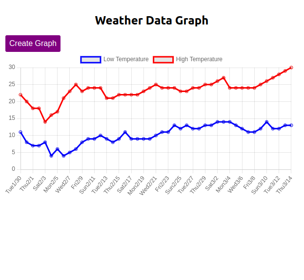

# Accuweather Daily weather Data Graph Maker


This is a chrome extension, that i have built for my personal user.

```"Being a programmer without coding for your own convenience is like an architect who designs incredible houses but forgets to build a home for themselves."```

## Context:

I check weather data on [accuweather.com](https://www.accuweather.com). But there is a problem that I face. Whenever I check the data, I don't understand future trends of data effectively.

So I decided to build an extension for myself, that generates a graph of the daily weather data on accuweather.com using **Chart.js**

Now, this helps me better understand weather trends.


## Screenshot:

